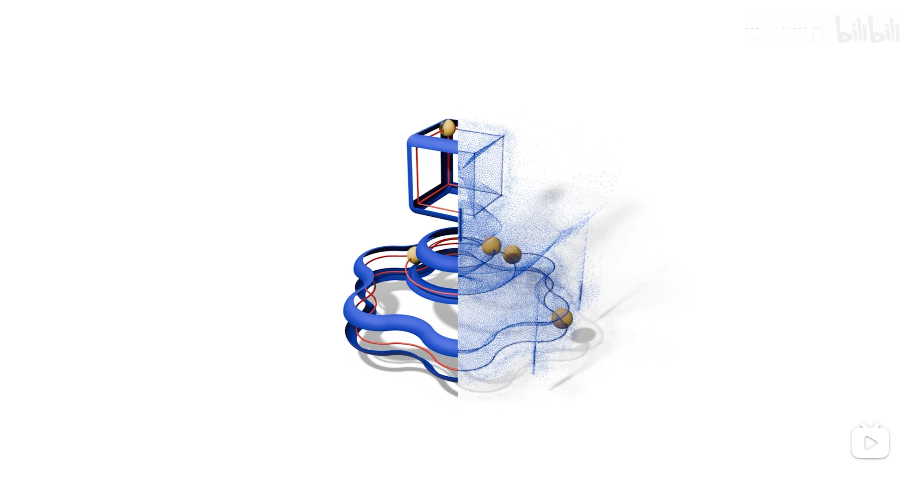

<p align="center">
  <p align="center">
    <h1 align="center">DeFillet: Detection and Removal of Fillet Regions in Polygonal CAD Models</h1>
  </p>
  <p align="center" style="font-size:16px">
    <a target="_blank" href="https://xiaowuga.github.io/"><strong>Jing-En Jiang</strong></a>
    ·
    <a target="_blank" href="https://github.com/hanxiaowang00"><strong>Hanxiao Wang</strong></a>
    ·
    <a target="_blank" href="https://zikai1.github.io/"><strong>Mingyang Zhao</strong></a>
    ·
    <a target="_blank" href="https://sites.google.com/site/yandongming/"><strong>Dong-Ming Yan</strong></a>
    ·
    <a target="_blank" href="https://xk.qust.edu.cn/info/1041/4695.htm"><strong>Shuangmin Chen</strong></a>
    .
    <a target="_blank" href="https://irc.cs.sdu.edu.cn/~shiqing/index.html"><strong>Shiqing Xin</strong></a>
    .
    <a target="_blank" href="https://faculty.sdu.edu.cn/tuzhanghe/en/index.htm"><strong>Changhe Tu</strong></a>
    .
    <a target="_blank" href="https://engineering.tamu.edu/cse/profiles/Wang-Wenping.html"><strong>Wenping Wang</strong></a>
</p>


### [Project Page](https://github.com/xiaowuga/DeFillet) | [Paper](https://github.com/xiaowuga/DeFillet) | [Poster](https://github.com/xiaowuga/DeFillet)

This repository contains the official implementation of our SIGGRAPH 2025 paper "DeFillet: Detection and Removal of Fillet Regions in Polygonal CAD Models".
[](https://www.bilibili.com/video/BV1sW8wz6EEc/?vd_source=092295aa747638ab207808257f039dea)

**Please give a star and cite if you find this repo useful.**

## Platform
- Windows 11
- CLion2024.1.2 +  Visual Stdio 2022
- Intel(R) Core i9-13900K

## Dependence

The dependent libraries of our code includes:
- Eigen3 (3.4.0 or later)
- libigl (2.5.0 or later)
- CGAL (5.6 or later)
- Easy3D (2.5.2 or later), Please visit the [Prof.Nan's repository](https://github.com/LiangliangNan/Easy3D) to obtain it and follow the instructions for installation.


## Build & Usage

Coming Soon! 

## Citation
If you make use of our work, please cite our paper:

```bibtex
@article{jiang2025defillet,
      title={DeFillet: Detection and Removal of Fillet Regions in Polygonal CAD Models}, 
      author={Jing-En Jiang and Hanxiao Wang and Mingyang Zhao and Dong-Ming Yan and Chen, Shuangmin and Xin, Shiqing and Tu, Changhe and Wang, Wenping },
      journal={ACM Transactions on Graphics (TOG)},
      publisher={ACM New York, NY, USA},
      year={2025},
      address = {New York, NY, USA},
      volume = {44},
      number = {4},
      issn = {0730-0301},
      url = {https://doi.org/10.1145/3731166},
      doi = {10.1145/3731166},
}
```


## Maintaince

If any problem, please contact me via <xiaowuga@gmail.com>.


